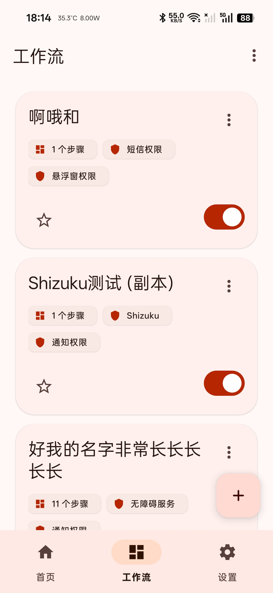
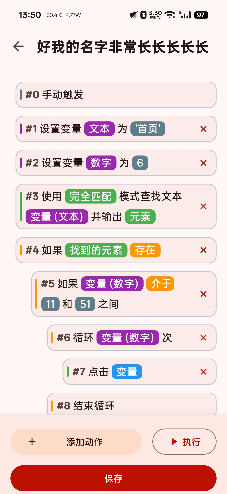
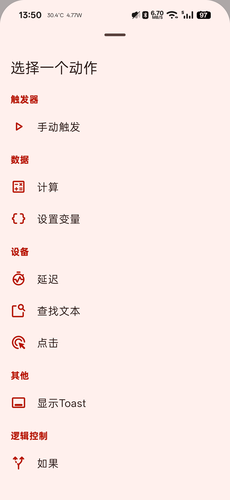

# vFlow - 强大的 Android 可视化工作流自动化工具

**vFlow** 是一款为 Android 平台设计的、强大且高度可扩展的自动化工具。它允许你通过图形化界面，将一系列“动作模块”自由组合成强大的“工作流”，从而自动完成各种日常的、重复性的屏幕操作任务。

## ✨ 项目简介

**vFlow 的核心设计理念** 是将复杂的自动化逻辑分解为一个个独立、可复用、易于理解的模块。无论是简单的“每日签到”，还是包含复杂条件判断和循环的“自动化测试流程”，vFlow 都旨在提供一个直观、灵活且强大的平台。

项目完全采用 Kotlin 编写，并遵循现代 Android 开发实践。其核心架构（模块注册表、动态UI生成器、类型安全的执行上下文）被精心设计，不仅保证了当前功能的稳定性，也为未来添加更多、更强大的自动化模块提供了无限可能。无论你是希望解放双手的普通用户，还是寻求灵感和实践的开发者，vFlow 都欢迎你的探索和贡献。

## 🚀 主要特性

* **可视化流程编辑器**: 通过拖拽和点击，像搭积木一样构建你的自动化流程。
* **高度模块化**: 每个功能（如点击、查找文本、判断）都是一个独立的模块，易于维护和扩展。
* **动态数据流**: 模块的输出可以作为后续模块的输入（“魔法变量”），实现复杂的逻辑联动。
* **强大的逻辑控制**: 支持“如果/否则”条件判断和“循环”等控制流，让你的工作流更智能。
* **动态参数编辑**: 编辑器UI会根据你选择的参数（例如，“如果”模块中变量的类型）动态变化，只显示相关的选项。
* **完善的权限管理**: 在执行前清晰地请求工作流所需的权限，并提供统一的管理入口。
* **现代UI设计**: 基于 Material 3 和动态取色，提供美观且个性化的用户界面。
* **导入与导出**: 轻松备份、恢复和分享你的工作流。

## 📸 应用截图

<table>
  <tr>
    <td></td>
    <td></td>
    <td></td>
  </tr>
  <tr>
    <td align="center">工作流列表</td>
    <td align="center">流程编辑器</td>
    <td align="center">模块选择器</td>
  </tr>
</table>


## 🛠️ 技术架构概览

vFlow 的核心是其高度解耦的模块化架构。

1.  **模块 (Module)**
    * 所有自动化动作的实现基础，每个模块都实现了 `ActionModule` 接口。
    * 模块负责定义自身的元数据（名称、图标）、输入输出参数、UI摘要、执行逻辑以及所需权限。
    * **示例**: `ClickModule`, `IfModule`, `LoopModule`。

2.  **模块注册表 (ModuleRegistry)**
    * 一个单例对象，在应用启动时注册所有可用的模块。
    * 为应用的其他部分（如动作选择器）提供按分类获取模块的能力。

3.  **工作流编辑器 (Workflow Editor)**
    * `WorkflowEditorActivity` 是核心UI，负责展示和操作 `ActionStep` 列表。
    * `ActionStepAdapter` 将 `ActionStep` 数据渲染为用户可见的卡片列表。
    * `ActionEditorSheet` 是一个通用的底部表单，它能根据任何模块的 `InputDefinition` 动态生成编辑界面，实现了UI与模块逻辑的完全解耦。

4.  **工作流执行器 (WorkflowExecutor)**
    * 负责按顺序执行工作流中的每一个步骤。
    * 为每个步骤创建包含上下文信息（如魔法变量值、服务实例）的 `ExecutionContext`。
    * 处理模块返回的不同结果，如成功、失败，或跳转、循环等流程控制信号。

## 📦 如何构建

1.  克隆仓库:
    ```bash
    git clone [https://github.com/ChaoMixian/vflow.git](https://github.com/ChaoMixian/vflow.git)
    ```
2.  使用 Android Studio 打开项目。
3.  等待 Gradle 同步完成。
4.  直接运行项目到你的设备或模拟器上。

## 🤝 如何贡献

我们非常欢迎各种形式的贡献！无论是提交 Issue、修复 Bug、添加新功能模块还是改进文档，都对项目意义重大。

1.  **Fork** 本仓库。
2.  创建你的功能分支 (`git checkout -b feature/AmazingFeature`)。
3.  提交你的改动 (`git commit -m 'Add some AmazingFeature'`)。
4.  推送到你的分支 (`git push origin feature/AmazingFeature`)。
5.  创建一个 **Pull Request**。

### 开发一个新模块

vFlow 最常见的贡献方式就是添加新的模块。步骤如下：

1.  在 `com.chaomixian.vflow.core.workflow.module` 包下的相应分类中创建一个新的 Kotlin 类。
2.  让它继承自 `BaseModule` 或 `BaseBlockModule`。
3.  实现 `ActionModule` 接口中的必要属性和方法（如 `id`, `metadata`, `getInputs`, `getOutputs`, `execute`）。
4.  在 `ModuleRegistry.kt` 的 `initialize()` 方法中注册你的新模块。
5.  就是这样！你的模块现在应该会自动出现在动作选择器中并可以正常使用了。

## 📄 许可证

本项目采用 [GPL License](LICENSE) 许可证。