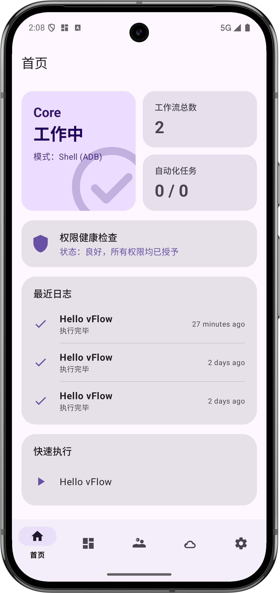
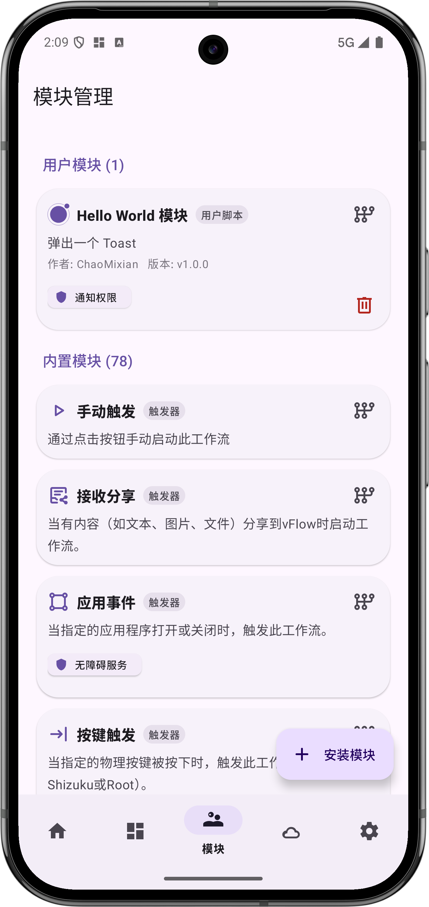
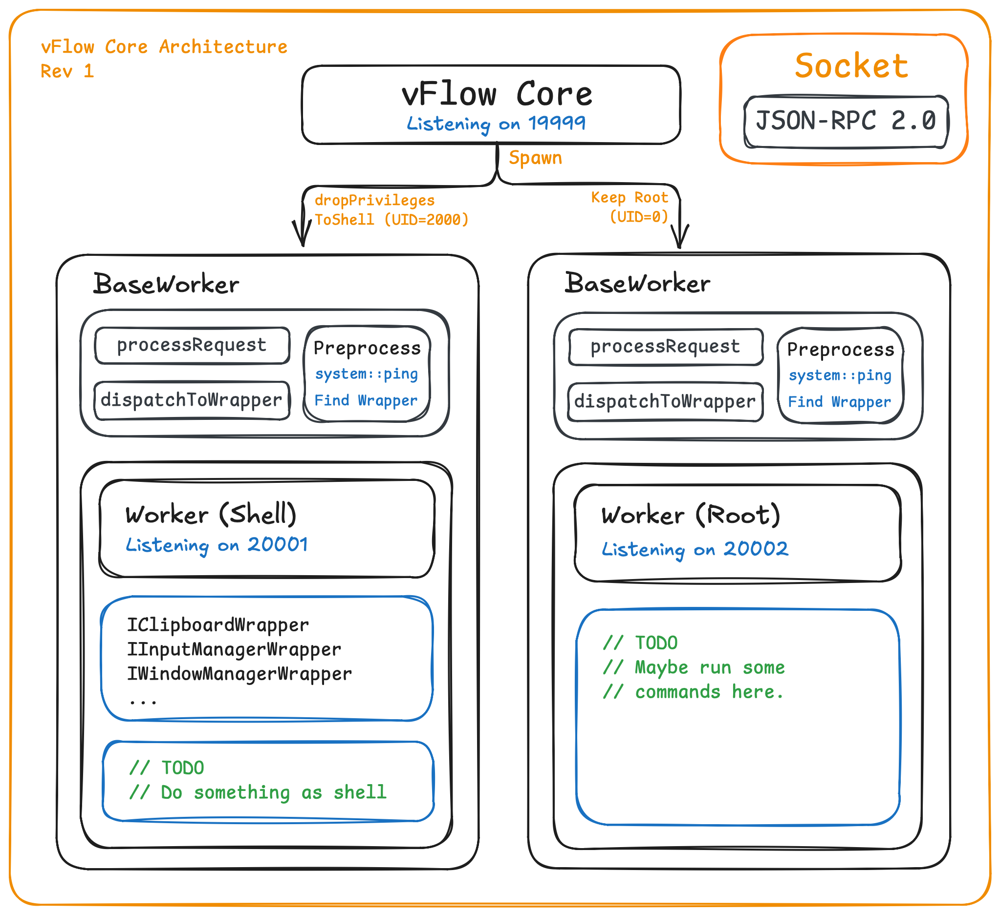

# vFlow - Powerful Android Visual Workflow Automation Tool

[中文](README.md)

[](https://github.com/ChaoMixian/vFlow/releases/latest)
[](https://github.com/ChaoMixian/vFlow/stargazers)
[](https://github.com/ChaoMixian/vFlow/network/members)
[](https://github.com/ChaoMixian/vFlow/issues)
[](LICENSE)
[](https://android-arsenal.com/api?level=21)
[](https://kotlinlang.org)

**vFlow** is a powerful and highly extensible automation tool designed for the Android platform. It allows you to freely combine a series of "action modules" into powerful "workflows" through a graphical interface, automating various daily and repetitive screen operation tasks.

## ✨ Overview

**vFlow's core design philosophy** is to decompose complex automation logic into independent, reusable, and easy-to-understand modules. Whether it's a simple "daily check-in" or an automated testing process with complex conditional judgments and loops, vFlow aims to provide an intuitive, flexible, and powerful platform.

The project is entirely written in Kotlin and follows modern Android development practices. Its core architecture (module registry, dynamic UI generator, type-safe execution context) is carefully designed to ensure the stability of current functionality and provides unlimited possibilities for adding more powerful automation modules in the future. Whether you're a regular user looking to free your hands or a developer seeking inspiration and practice, vFlow welcomes your exploration and contributions.

## 📸 Screenshots

<table>
  <tr>
    <td></td>
    <td></td>
    <td></td>
  </tr>
  <tr>
    <td align="center">Home</td>
    <td align="center">Workflow Editor</td>
    <td align="center">Module Manager</td>
  </tr>
</table>

## 🚀 Key Features

- **Visual Flow Editor**: Build your automation workflows by dragging and clicking, like building with blocks.
- **Highly Modular**: Each function (such as click, find text, judgment) is an independent module, easy to maintain and extend.
- **Dynamic Data Flow**: The output of a module can serve as input for subsequent modules ("magic variables"), enabling complex logic linkage.
- **Powerful Logic Control**: Supports "If/Else" conditional judgment and "Loop" control flows, making your workflows smarter.
- **Dynamic Parameter Editing**: The editor UI dynamically changes based on the parameters you select (e.g., variable types in "If" modules), showing only relevant options.
- **Complete Permission Management**: Clearly request permissions required by the workflow before execution and provide a unified management entry.
- **Modern UI Design**: Based on Material 3 and dynamic color extraction, providing a beautiful and personalized user interface.
- **Import & Export**: Easily backup, restore, and share your workflows.

## 🛠️ Technical Architecture Overview

The core of the vFlow App is its highly decoupled modular architecture.

1.  **Module**

    - The foundation for all automation action implementations, each module implements the `ActionModule` interface.
    - Modules are responsible for defining their own metadata (name, icon), input/output parameters, UI summaries, execution logic, and required permissions.
    - **Examples**: `ClickModule`, `IfModule`, `LoopModule`.

2.  **ModuleRegistry**

    - A singleton object that registers all available modules when the application starts.
    - Provides the ability to retrieve modules by category for other parts of the application (such as the action selector).

3.  **Workflow Editor**

    - `WorkflowEditorActivity` is the core UI responsible for displaying and operating the `ActionStep` list.
    - `ActionStepAdapter` renders `ActionStep` data into a visible card list for users.
    - `ActionEditorSheet` is a universal bottom sheet that dynamically generates editing interfaces based on any module's `InputDefinition`, achieving complete decoupling of UI and module logic.

4.  **WorkflowExecutor**

    - Responsible for executing each step in the workflow in sequence.
    - Creates an `ExecutionContext` for each step containing context information (such as magic variable values, service instances).
    - Handles different results returned by modules, such as success, failure, or flow control signals like jumps and loops.

vFlow Core adopts a Master-Worker multi-process architecture, using TCP Socket communication with a custom JSON-RPC protocol to dynamically route instructions to Shell or Root privilege child processes, achieving strict permission isolation and efficient system service management.



## 📦 How to Build

1.  Clone the repository:
    ```bash
    git clone https://github.com/ChaoMixian/vflow.git
    ```
2.  Open the project with Android Studio.
3.  Wait for Gradle synchronization to complete.
4.  Run the project directly on your device or emulator.

## 🤝 How to Contribute

We welcome contributions in any form! Whether it's submitting issues, fixing bugs, adding new feature modules, or improving documentation, all are significant to the project.

1.  **Fork** this repository.
2.  Create your feature branch (`git checkout -b feature/AmazingFeature`).
3.  Commit your changes (`git commit -m 'Add some AmazingFeature'`).
4.  Push to your branch (`git push origin feature/AmazingFeature`).
5.  Create a **Pull Request**.

### 💻 Developing a New Module

The most common way to contribute to vFlow is by adding new modules. Steps:

1.  Create a new Kotlin class in the appropriate category under the `com.chaomixian.vflow.core.workflow.module` package.
2.  Make it inherit from `BaseModule` or `BaseBlockModule`.
3.  Implement the necessary properties and methods in the `ActionModule` interface (such as `id`, `metadata`, `getInputs`, `getOutputs`, `execute`).
4.  Register your new module in the `initialize()` method of `ModuleRegistry.kt`.
5.  That's it! Your module should now automatically appear in the action selector and work properly.

[Development Guide](docs/CONTRIBUTION.md)

## 🌟 Star the Project

[](https://www.star-history.com/#ChaoMixian/vFlow&type=date&legend=top-left)

## 📄 License

This project is licensed under the [GPL License](LICENSE).

## 💰 Sponsorship

vFlow is still developing and lags significantly in functionality compared to mature software. Currently, we are operating on a voluntary basis and **do not accept sponsorships**. Thank you.

Sponsor List (not through the vFlow project, in chronological order):
```
鲨鱼辣椒    RMB 18.88   2026/01/29
罗密欧的沉默  RMB 26.66   2026/02/10
```