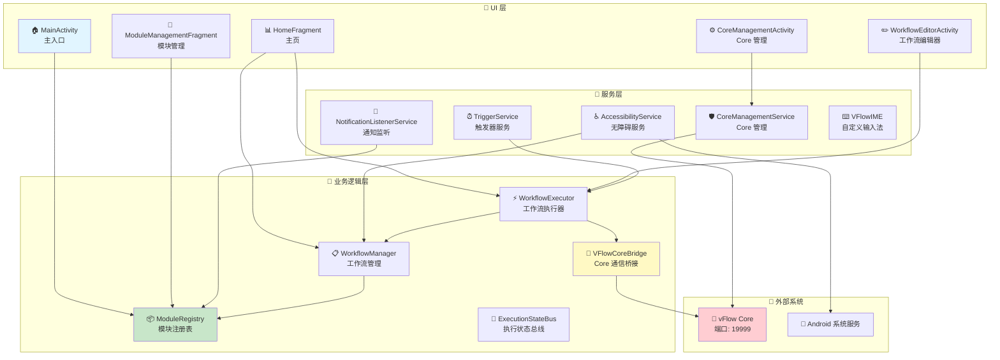
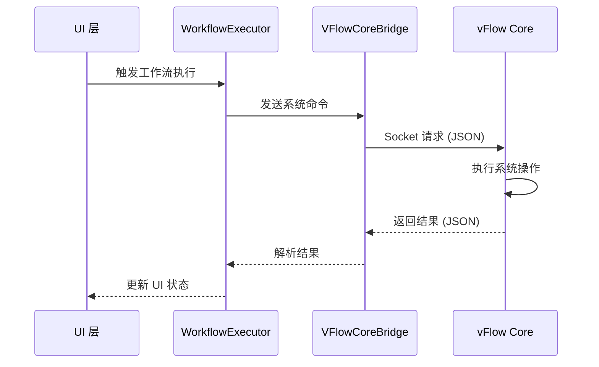

# vFlow App 架构说明

## 架构概览

vFlow App 采用**模块化分层架构**，将 UI 层、服务层和业务逻辑层分离，通过 ModuleRegistry 实现高度可扩展的功能模块系统。App 通过 Socket 与 vFlow Core 通信，实现工作流的自动化执行和系统服务调用。

## 架构图



## 核心组件

| 组件 | 说明 | 类型 |
|------|------|------|
| **MainActivity** | 应用主入口，初始化模块系统，管理底部导航 | Activity |
| **HomeFragment** | 主页，显示工作流统计、Core 状态、权限检查 | Fragment |
| **WorkflowEditorActivity** | 工作流可视化编辑器 | Activity |
| **ModuleManagementFragment** | 模块管理界面，支持模块的导入/导出/启用 | Fragment |
| **CoreManagementActivity** | vFlow Core 进程管理和状态监控 | Activity |
| **TriggerService** | 后台触发器服务，监听系统事件触发工作流 | Service |
| **CoreManagementService** | Core 服务管理，启动/停止 Core 进程 | Service |
| **AccessibilityService** | 无障碍服务，实现屏幕元素识别和操作 | Service |
| **NotificationListenerService** | 通知监听服务，捕获通知事件 | Service |
| **VFlowIME** | 自定义输入法，绕过部分系统限制 | InputMethodService |
| **ModuleRegistry** | 模块注册表，管理所有功能模块 | Core |
| **WorkflowManager** | 工作流管理器，加载/保存/执行工作流 | Core |
| **WorkflowExecutor** | 工作流执行器，执行工作流中的动作 | Core |
| **VFlowCoreBridge** | Core 通信桥接器，Socket 通信客户端 | Core |
| **ExecutionStateBus** | 执行状态总线，广播工作流执行状态 | Core |

## 架构层次

```
┌─────────────────────────────────────────┐
│            UI 层                         │
│  ├── Activity（主界面、编辑器、设置）    │
│  ├── Fragment（主页、列表、管理）        │
│  └── 其他 UI 组件（对话框、Picker）      │
└─────────────────────────────────────────┘
                   ↓
┌─────────────────────────────────────────┐
│            服务层                        │
│  ├── TriggerService（触发器）            │
│  ├── CoreManagementService（Core 管理）  │
│  ├── AccessibilityService（无障碍）      │
│  ├── NotificationListenerService（通知） │
│  └── VFlowIME（输入法）                 │
└─────────────────────────────────────────┘
                   ↓
┌─────────────────────────────────────────┐
│          业务逻辑层                      │
│  ├── ModuleRegistry（模块注册表）        │
│  ├── WorkflowManager（工作流管理）       │
│  ├── WorkflowExecutor（工作流执行器）    │
│  ├── VFlowCoreBridge（Core 通信）        │
│  └── ExecutionStateBus（状态总线）       │
└─────────────────────────────────────────┘
                   ↓
┌─────────────────────────────────────────┐
│          外部交互层                      │
│  ├── vFlow Core（系统服务调用）          │
│  ├── Android 系统服务（原生 API）        │
│  └── GitHub API（模块仓库）              │
└─────────────────────────────────────────┘
```

## 与 vFlow Core 的交互

### 通信方式

vFlow App 通过 **Socket (TCP/IP)** 与 vFlow Core 进程通信：

- **地址**: `127.0.0.1:19999`
- **协议**: JSON 格式请求/响应
- **桥接器**: `VFlowCoreBridge`

### 请求流程



### 主要交互功能

| 功能 | Target | Method |
|------|--------|--------|
| 健康检查 | `system` | `ping` |
| 点击屏幕 | `input` | `tap` |
| 滑动屏幕 | `input` | `swipe` |
| 输入文本 | `input` | `inputText` |
| 剪贴板操作 | `clipboard` | `getClipboard` / `setClipboard` |
| 唤醒屏幕 | `power` | `wakeUp` |
| 关闭屏幕 | `power` | `goToSleep` |
| 开关 WiFi | `wifi` | `setWifiEnabled` |
| 开关蓝牙 | `bluetooth_manager` | `setBluetoothEnabled` |
| 强制停止应用 | `activity` | `forceStopPackage` |

## 模块系统

### ModuleRegistry

vFlow App 的核心是 **ModuleRegistry**，它负责：

1. **模块注册**: 扫描并注册所有功能模块
2. **模块发现**: 动态加载模块（ActionModule、TriggerModule、DataModule）
3. **模块管理**: 启用/禁用模块，查询模块信息

### 模块类型

| 类型 | 说明 | 示例 |
|------|------|------|
| **ActionModule** | 动作模块，执行具体操作 | 点击、滑动、打开应用 |
| **TriggerModule** | 触发器模块，监听事件 | 定时器、通知触发、位置触发 |
| **DataModule** | 数据模块，提供数据 | 应用列表、设备信息 |
| **ConditionModule** | 条件模块，逻辑判断 | WiFi 状态、屏幕状态 |

### 模块扩展

开发者可以通过继承对应的模块基类来扩展功能：

```kotlin
class CustomActionModule : ActionModule() {
    override fun execute(context: Context, params: Map<String, Any>) {
        // 自定义动作逻辑
    }
}
```

## 技术栈

- **语言**: Kotlin
- **UI**: Activity + Fragment + ViewBinding
- **异步**: Kotlin Coroutines
- **通信**: Socket (vFlow Core)、Intent (Service)、EventBus (状态)
- **存储**: SharedPreferences、文件系统 (JSON)
- **无障碍**: AccessibilityService API
- **输入法**: InputMethodService API

## 架构特点

### 优势

1. **模块化**: 通过 ModuleRegistry 实现高度可扩展的模块系统
2. **松耦合**: 各层职责明确，依赖关系清晰
3. **异步处理**: 大量使用协程处理耗时操作
4. **权限灵活**: 支持多种权限模式（Shell/Root/None）
5. **事件驱动**: 基于 EventBus 的状态广播机制

### 设计模式

- **Repository Pattern**: 数据层抽象
- **Observer Pattern**: EventBus 状态监听
- **Factory Pattern**: 模块实例化
- **Bridge Pattern**: VFlowCoreBridge 解耦 App 和 Core

## 相关文档

- [vFlowCore_Architecture.md](vFlow_Core_Architecture.md) - vFlow Core 多进程架构文档
- [README.md](../README.md) - 项目总体介绍

---

**文档更新时间**: 2026-01-15
**维护者**: vFlow Team
