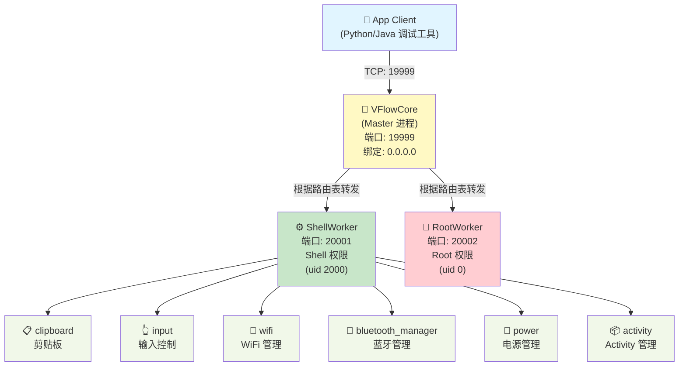
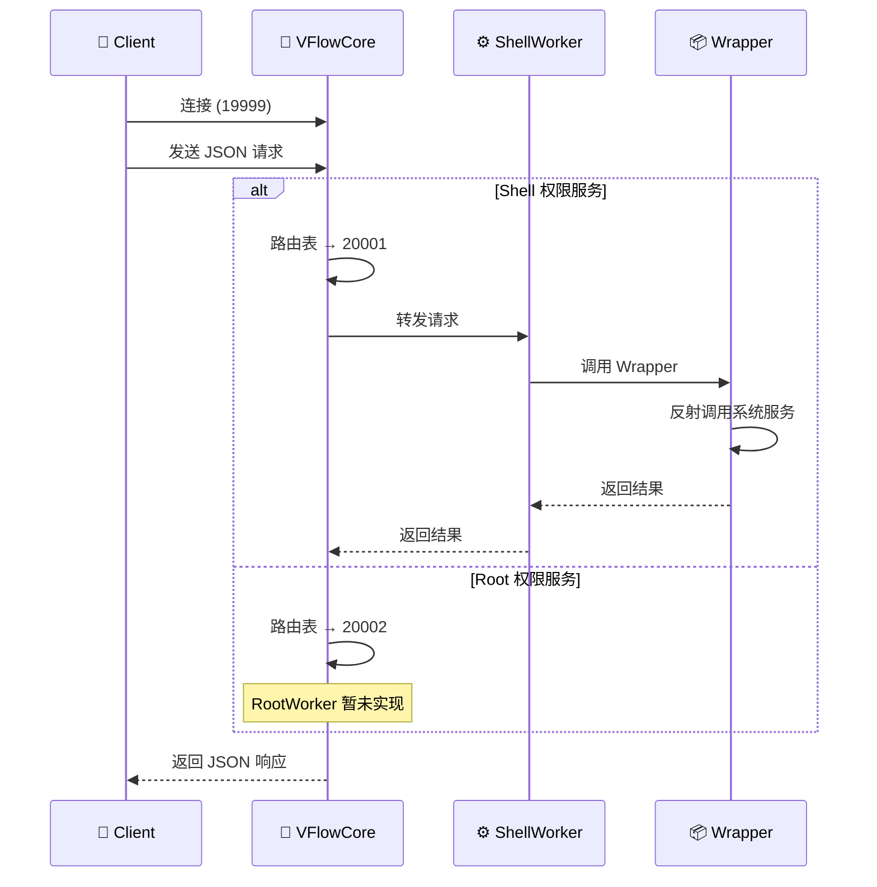

# vFlow Core 多进程架构文档

## 📋 架构概览

vFlow Core 采用 **Master-Worker** 多进程架构，实现权限分离和服务隔离。

### 架构图



### 组件说明

| 组件 | 说明 | 端口 | 权限 |
|------|------|------|------|
| **VFlowCore** | Master 进程，负责请求路由 | 19999 | - |
| **ShellWorker** | Shell 级别的服务封装 | 20001 | Shell (uid 2000) |
| **RootWorker** | Root 级别的服务封装 | 20002 | Root (uid 0) |

## 🚀 启动方式

### 通过 App 启动（推荐）

```bash
# App 使用 app_process 启动 VFlowCore
export CLASSPATH="/sdcard/vFlow/temp/vFlowCore.dex"
exec app_process /system/bin com.chaomixian.vflow.server.VFlowCore
```

**自动启动：**
- VFlowCore (端口 19999) - Master 进程
- ShellWorker (端口 20001) - Shell 级别的操作
- RootWorker (端口 20002) - Root 级别的操作（如果需要）

### 手动启动（调试）

```bash
# 设置 CLASSPATH
export CLASSPATH="/path/to/vFlowCore.dex"

# 启动 VFlowCore
app_process /system/bin com.chaomixian.vflow.server.VFlowCore
```

## 📁 目录结构

```
server/src/main/java/com/chaomixian/vflow/server/
├── VFlowCore.kt                      # [主入口] Master 进程入口
├── worker/                           # [执行层] Worker 子进程
│   ├── BaseWorker.kt                 # Worker 抽象基类
│   ├── ShellWorker.kt                # Shell Worker (uid 2000)
│   └── RootWorker.kt                 # Root Worker (uid 0)
├── wrappers/                         # [业务层] Android 系统服务封装
│   ├── ServiceWrapper.kt             # Wrapper 抽象基类
│   └── shell/                        # Shell 权限的 Wrappers
│       ├── IClipboardWrapper.kt      # 剪贴板服务
│       ├── IInputManagerWrapper.kt   # 输入管理服务
│       ├── IWifiManagerWrapper.kt    # WiFi 管理服务
│       ├── IBluetoothManagerWrapper.kt # 蓝牙管理服务
│       ├── IPowerManagerWrapper.kt   # 电源管理服务
│       └── IActivityManagerWrapper.kt # Activity 管理服务
└── common/                           # [通用层]
    ├── Config.kt                     # 配置常量（端口、路由表）
    └── utils/
        ├── ReflectionUtils.kt        # 反射工具（方法查找）
        └── SystemUtils.kt            # 系统工具（UID/权限检查）
```

## 🔄 通信流程

### 请求时序图



### 流程说明

1. **连接建立**：Client 连接到 VFlowCore (端口 19999)
2. **请求发送**：Client 发送 JSON 格式的请求
3. **路由查询**：Master 查询 `Config.ROUTING_TABLE`
4. **请求转发**：根据 target 转发到对应的 Worker
5. **服务调用**：Worker 调用对应的 Wrapper
6. **系统调用**：Wrapper 通过反射调用 Android 系统服务
7. **结果返回**：结果沿原路返回给 Client

### 路由表配置

```kotlin
// Config.kt
val ROUTING_TABLE = mapOf(
    // Shell Worker (端口 20001) - Shell 权限可处理
    "clipboard" to 20001,
    "input" to 20001,
    "wifi" to 20001,
    "bluetooth_manager" to 20001,
    "power" to 20001,
    "activity" to 20001,

    // Root Worker (端口 20002) - 需要 Root 权限
    "system_root" to 20002
)
```

### 请求格式 (JSON)

```json
{
  "target": "input",           // 服务名称（target）
  "method": "tap",             // 方法名
  "params": {                  // 参数（JSON 对象）
    "x": 500,
    "y": 1000
  }
}
```

### 响应格式 (JSON)

**成功：**
```json
{
  "success": true,
  "text": "返回数据"  // 根据方法不同而不同
}
```

**失败：**
```json
{
  "success": false,
  "error": "错误信息"
}
```

## 📦 已实现的服务

### Shell Worker (端口 20001) - Shell 权限

| Target | 功能 | 方法 | 说明 |
|--------|------|------|------|
| `system` | 系统控制 | `ping`, `exit` | 服务健康检查、退出 Core |
| `clipboard` | 剪贴板 | `getClipboard`, `setClipboard` | 获取/设置剪贴板内容 |
| `input` | 输入控制 | `tap`, `swipe`, `key`, `inputText` | 点击、滑动、按键、输入文本 |
| `wifi` | WiFi 管理 | `setWifiEnabled` | 开关 WiFi |
| `bluetooth_manager` | 蓝牙管理 | `setBluetoothEnabled` | 开关蓝牙（支持 Android 12+） |
| `power` | 电源管理 | `wakeUp`, `goToSleep` | 唤醒/关闭屏幕 |
| `activity` | Activity 管理 | `forceStopPackage` | 强制停止应用（Shell 权限） |

### Root Worker (端口 20002) - Root 权限

| Target | 功能 | 说明 |
|--------|------|------|
| (预留) | 暂未实现 | 未来可添加需要 Root 的操作 |

### Wrapper 注册机制

Wrappers 采用**直接注册**方式，在各 Worker 的 `registerWrappers()` 方法中注册：

```kotlin
// ShellWorker.kt
override fun registerWrappers() {
    wrappers["clipboard"] = IClipboardWrapper()
    wrappers["input"] = IInputManagerWrapper()
    wrappers["wifi"] = IWifiManagerWrapper()
    wrappers["bluetooth_manager"] = IBluetoothManagerWrapper()
    wrappers["power"] = IPowerManagerWrapper()
    wrappers["activity"] = IActivityManagerWrapper()
}
```

## 🔧 使用示例

### Android 端 (Kotlin)

```kotlin
import java.io.BufferedReader
import java.io.InputStreamReader
import java.io.PrintWriter
import java.net.Socket
import org.json.JSONObject

fun callVFlowCore(target: String, method: String, params: Map<String, Any>): JSONObject {
    val socket = Socket("127.0.0.1", 19999)
    val writer = PrintWriter(socket.getOutputStream(), true)
    val reader = BufferedReader(InputStreamReader(socket.getInputStream()))

    val request = JSONObject().apply {
        put("target", target)
        put("method", method)
        put("params", JSONObject(params))
    }

    writer.println(request.toString())
    val response = JSONObject(reader.readLine())

    socket.close()
    return response
}

// 示例：点击屏幕
val result = callVFlowCore("input", "tap", mapOf(
    "x" to 500,
    "y" to 1000
))

// 示例：设置剪贴板
val result = callVFlowCore("clipboard", "setClipboard", mapOf(
    "text" to "Hello vFlow"
))

// 示例：强制停止应用
val result = callVFlowCore("activity", "forceStopPackage", mapOf(
    "package" to "com.example.app"
))
```

### Python 调试工具

```python
import socket
import json

def call_vflow_core(target, method, params):
    sock = socket.socket(socket.AF_INET, socket.SOCK_STREAM)
    sock.connect(("127.0.0.1", 19999))

    request = {
        "target": target,
        "method": method,
        "params": params
    }

    sock.sendall((json.dumps(request) + "\n").encode('utf-8'))
    response = json.loads(sock.recv(4096).decode('utf-8'))
    sock.close()

    return response

# 示例：开启 WiFi
result = call_vflow_core("wifi", "setWifiEnabled", {"enabled": True})

# 示例：唤醒屏幕
result = call_vflow_core("power", "wakeUp", {})
```

或使用 **vflowcore_debugger.py** GUI 调试工具：
```bash
python3 vflowcore_debugger.py
```

## 🔍 调试

### 检查进程状态

```bash
# 检查 VFlowCore 是否运行
ps | grep app_process

# 检查端口监听
netstat -an | grep -E "19999|20001|20002"

# 或使用 ss 命令
ss -an | grep -E "19999|20001|20002"
```

### 使用 vflowcore_debugger.py

```bash
python3 vflowcore_debugger.py
```

功能：
- 📡 连接到 VFlowCore（支持远程连接）
- 🎯 手动测试各个接口
- 🧪 自动测试所有接口
- 📊 生成测试报告

### Ping 测试

```bash
# 通过 Master ping
echo '{"target":"system","method":"ping"}' | nc 127.0.0.1 19999

# 预期响应
{"success": true, "message": "pong", "uid": 2000}
```

### Logcat 调试

```bash
# 查看 ShellWorker 日志
adb logcat | grep ShellWorker

# 查看 RootWorker 日志
adb logcat | grep RootWorker

# 查看特定 Wrapper 日志
adb logcat | grep "IBluetoothManagerWrapper"
```

## ⚡ 性能特点

1. **进程隔离**：不同权限的服务运行在不同进程（Master、ShellWorker、RootWorker）
2. **权限分离**：ShellWorker (uid 2000) 处理大部分操作，RootWorker 仅处理需要 Root 的操作
3. **方法缓存**：反射方法在 `onServiceConnected()` 时缓存，避免每次查找
4. **动态参数适配**：支持不同 Android 版本的 API 差异（如 AttributionSource）
5. **长连接支持**：连接后移除 socket 超时，支持长时间调试

## 🔧 配置说明

### Config.kt 关键配置

```kotlin
object Config {
    // 端口配置
    const val PORT_MASTER = 19999        // Master 监听端口（对外）
    const val PORT_WORKER_SHELL = 20001  // Shell Worker 端口
    const val PORT_WORKER_ROOT = 20002   // Root Worker 端口

    // 地址配置
    const val LOCALHOST = "127.0.0.1"    // 本地回环
    const val BIND_ADDRESS = "0.0.0.0"    // 绑定所有网卡（支持远程连接）

    // 路由表
    val ROUTING_TABLE = mapOf(
        "clipboard" to PORT_WORKER_SHELL,
        "input" to PORT_WORKER_SHELL,
        "wifi" to PORT_WORKER_SHELL,
        "bluetooth_manager" to PORT_WORKER_SHELL,
        "power" to PORT_WORKER_SHELL,
        "activity" to PORT_WORKER_SHELL,
        "system_root" to PORT_WORKER_ROOT
    )
}
```

## 🎯 特殊实现

### Android 12+ AttributionSource 支持

`IBluetoothManagerWrapper` 自动适配 Android 12+ 的 AttributionSource API：

```kotlin
// 动态检测参数类型
val attributionSourceClass = Class.forName("android.content.AttributionSource")

// 根据参数类型填充
when {
    attributionSourceClass != null && paramType == attributionSourceClass -> {
        createAttributionSource()  // Android 12+
    }
    paramType == String::class.java -> "com.android.shell"  // Android 11-
}
```

### 参数类型自动适配

Wrappers 自动处理不同参数类型：
- `int` → `Integer.valueOf(0)`
- `boolean` → `Boolean.FALSE`
- `String` → `"com.android.shell"` 或 `""`
- `AttributionSource` → 反射创建

## 📝 版本信息

- **版本**: v2.1
- **架构**: Master-Worker 多进程
- **最小 Android 版本**: API 21+
- **最大兼容性**: 适配 Android 各版本 API 差异
- **支持平台**: Android 真机和模拟器

## 📚 相关文档

- [vflowcore_debugger_README.md](vflowcore_debugger_README.md) - 调试工具使用说明
- [README.md](../README.md) - 项目总体介绍

## 🔜 已完成特性

- ✅ 7 个系统服务封装（clipboard、input、wifi、bluetooth、power、activity、system）
- ✅ 直接注册机制（各 Worker 手动注册 Wrappers）
- ✅ 动态参数适配（支持不同 Android 版本）
- ✅ GUI 调试工具（vflowcore_debugger.py）
- ✅ 自动测试功能（13 个测试用例）
- ✅ 远程连接支持（绑定 0.0.0.0）
- ✅ Shell 权限支持大部分操作（包括 forceStopPackage）

---

**文档更新时间**: 2026-01-15
**维护者**: vFlow Team
